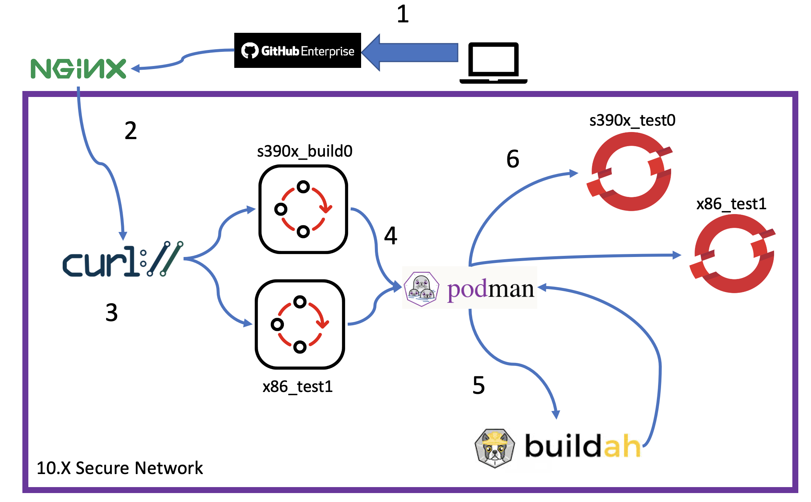
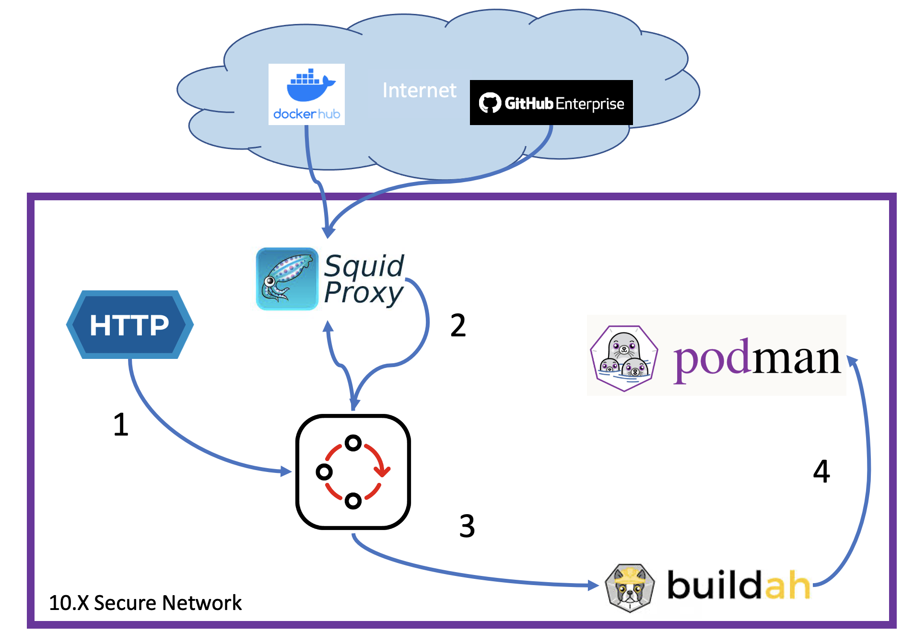

# petstore-pipelines-files
Repository for build and deployment pipelines. Petstore has been configured to be built and deployed on x86 and s390x using multi-arch manifests. The general flow for each app is approximately the same, however, they each require some extra, unique configuration steps.
The motivation of this repository is the idea that build and test clusters should not be manually modified. Therefore, OCP pipelines have been created to propogate the changes made in this cluster to the build and test clusters. Also, all of this can be setup to occur inside a disconnected environment.
A long form explanation can be found in [this document](https://ibm.biz/BdyaPz).
## MultiArch Build Flow

1. Developer pushes change GitHub Enterprise which creates a webhook sent to an Nginx Reverse Proxy
2. The prime build pipeline (which is responsible for orchestration of architecture specific build pipelines) begins execution on receiving the webhook forwarded by Nginx. The event listener, route, trigger binding and trigger template YAMLS are available in the [./build/build-prime-pipeline](build/build-prime-pipeline/) directory.
3. Prime build pipeline starts the architecture specific build pipelines by curling event listeners connected to each architecture specific build pipeline. The event listener, route, trigger binding, trigger template and pipeline YAMLS are available in the [./build/build-pipeline](build/build-pipeline/) directory.
4. The architecture specific build pipelines finish and push their image to a container registry.
5. The prime build pipeline recognizes that all architecture specific build pipelines have completed using BASH scripting and the `tekton` CLI. A multiarch ("fat") manifest is assembled via a custom cluster task ([./build/build-prime-pipeline/assemble-manifest-task.yaml](./build/build-prime-pipeline/assemble-manifest-task.yaml)) with BASH scripting and the `buildah` CLI.
6. The prime build pipeline starts the execution of [architecture specific pipelines](./deploy/deploy-pipeline/) used for deploying the application. In this case, the important part is that both x86 and s390x can `oc new-app` and reference the same manifest, `petstore/petstore:latest`.
## Architecture Specific Build Pipeline

1. The architecture specific build pipeline begins execution using the pipelinerun created by the event listeners configured [here](./build/build-pipeline) and any parameters passed from the prime build pipeline via curl.
2. The source code is pulled from GitHub enterprise via a proxy to a persistent volume (PV) in OCP
3. The `buildah` ClusterTask (provided by RedHat with the OpenShift Pipelines operator) builds the container image from a Dockerfile using the `buildah bud` command and the source code in the PV. In this case, IBM Semeru Java is used but other run times could also be used.
4. Once the image is built, it is pushed to an on-prem container registry.
## Other notes
- Various custom clustertasks have been added into my pipelines. I did my best to include them all but some may be missing. Additionally, the custom clustertasks may reference specific sha's rather than a `latest` tag so bear that in mind.
- All instances of my test environment hostname have been replaced with the text `your.hostname.here.com`. These can be removed using `sed` in each place yaml is stored with `sed -i.bak "s/your.hostname.here.com/<fill.in.here>.com/g *.yaml`
## petstore
These pipelines build and deploy the petstore app available [here](https://github.ibm.com/LinuxCoC/petstore) (IBM Internal Link).
